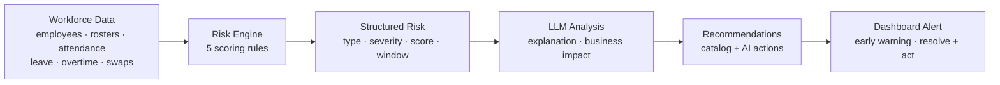
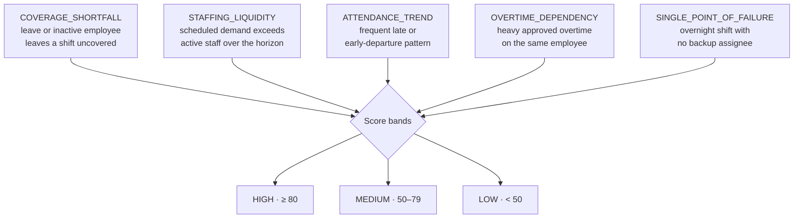
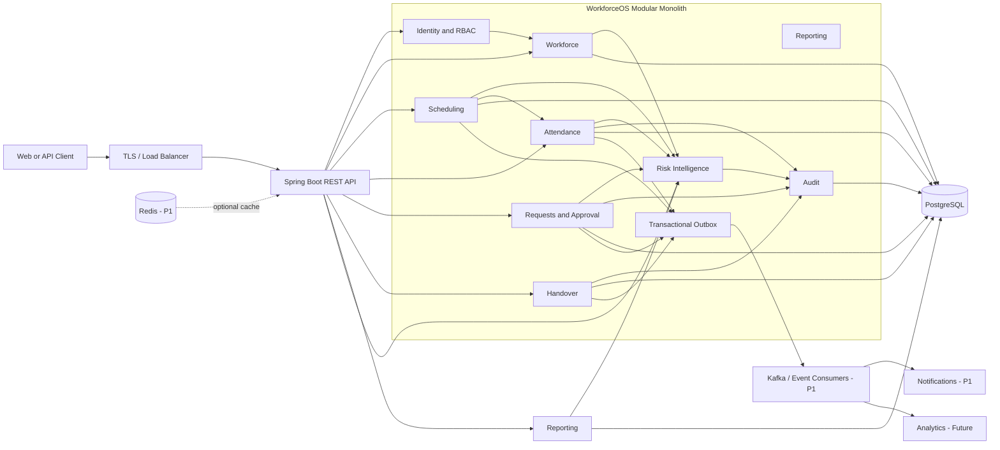
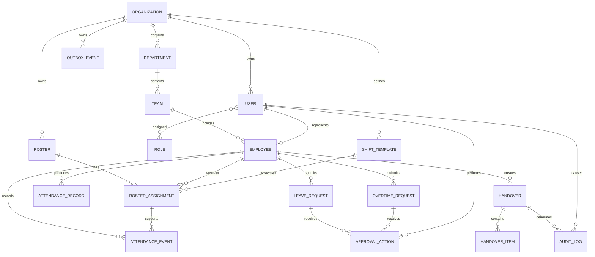
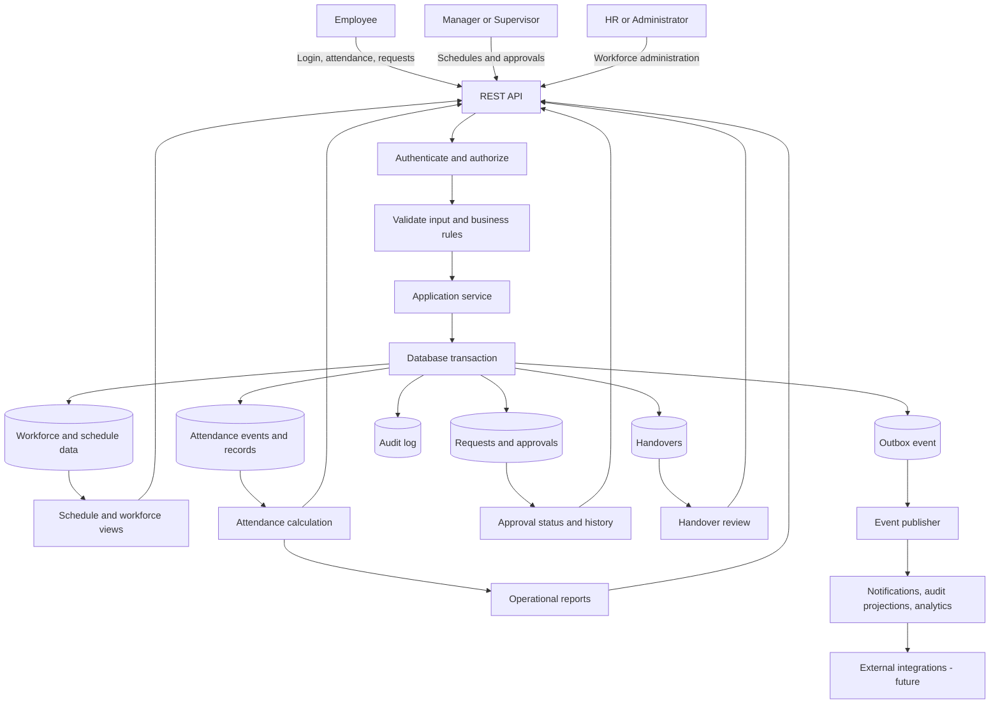

# WorkforceOS

WorkforceOS is an enterprise REST API platform for organizations with shift-based employees. It centralizes workforce scheduling, attendance, leave, overtime, shift handover, approvals, notifications, auditing, and reporting in one auditable backend.

> **Status:** Active development. The backend implements most of the P0 MVP scope from the PRD plus the workforce risk intelligence pipeline (risk detection, LLM/heuristic analysis, alerts, and recommendations) against in-memory operational data with persisted risk assessments; PostgreSQL persistence for operational domain data, Redis caching, Kafka-based events, and the remaining P1/P2 scope are still in progress.

## Implementation Status

The backend (`backend/`) is a Spring Boot 3 / Java 21 modular monolith with the following implemented:

- JWT authentication (`/api/v1/auth/login`) and bearer-token security filter
- Workforce management: employees, departments, teams
- Scheduling: shift templates, rosters, roster assignments, roster publishing
- Attendance: clock in/out, attendance corrections
- Requests and approvals: leave requests, overtime requests, shift swap requests
- Shift handover: create, submit, acknowledge
- Workforce risk intelligence: risk engine, LLM/heuristic analysis, alerts, and recommendations (see below)
- Notifications, audit logging, and operational reports
- `GET /api/v1/health` service health endpoint

Domain operational data currently lives in in-memory repositories, while risk assessments, recommendations, and alerts are persisted (PostgreSQL via Flyway). PostgreSQL persistence for operational domain data, Redis caching, Kafka-based events, and the remaining P1/P2 scope are tracked in the [roadmap](docs/ROADMAP.md).

The frontend (`frontend/`) is an Angular 16 project with the login, workforce overview, and risk intelligence dashboards built.

## Run Locally

### Backend

Prerequisites: Java 21 and Maven 3.9 or later.

The development authentication account defaults to `admin` / `admin`. Override it before running with:

```powershell
$env:WORKFORCE_AUTH_SIGNING_KEY = "replace-with-a-long-random-secret"
$env:WORKFORCE_AUTH_ADMIN_USERNAME = "admin"
$env:WORKFORCE_AUTH_ADMIN_PASSWORD = "replace-with-a-strong-password"
```

```bash
mvn spring-boot:run
```

Then check `http://localhost:8080/api/v1/health`.

Run the tests with:

```bash
mvn test
```

### Frontend

Prerequisites: Node.js and npm.

```bash
cd frontend
npm install
npm start
```

Then open `http://localhost:4200/`.

### Docker

Prerequisites: Docker.

```bash
docker compose up --build
```

This builds and runs the backend (`http://localhost:8080`) and the frontend (`http://localhost:4200`, proxying `/api` requests to the backend). Override the auth environment variables from the section above via a `.env` file or your shell before running `docker compose up`.

## Product Vision

Provide a reliable, auditable, and scalable platform that helps organizations plan schedules, monitor attendance, manage workforce requests, and maintain continuity between shifts.

## Why WorkforceOS

Shift-based organizations commonly depend on spreadsheets, messaging applications, and disconnected systems. This makes it difficult to:

- Maintain accurate rosters and prevent overlapping assignments
- See who is scheduled, present, late, absent, or working overtime
- Track leave, overtime, shift swaps, and attendance corrections
- Preserve operational knowledge between shifts
- Identify who performed or approved an action

WorkforceOS provides a centralized source of operational workforce data and business rules.

## Core Capabilities

- **Authentication and authorization**: JWT authentication and role-based access control
- **Workforce management**: Employees, departments, teams, and positions
- **Scheduling**: Shift templates, overnight shifts, rosters, publishing, and conflict detection
- **Attendance**: Clock in/out, breaks, lateness, early departure, absence, and overtime calculation
- **Requests**: Leave, overtime, shift swap, and attendance correction workflows
- **Shift handover**: Operational summaries, tasks, incidents, equipment, safety notes, and acknowledgement
- **Approvals**: Reusable approval lifecycle with approval history
- **Audit**: User activity, data changes, approvals, and operational events
- **Reporting**: Attendance, workforce, overtime, leave, absence, and approval reports
- **Notifications**: Events such as roster publication and request decisions
- **Workforce risk intelligence**: Early detection of coverage shortfalls, staffing liquidity, attendance trends, overtime dependency, and single-point-of-failure risks, with LLM or heuristic analysis, business impact estimates, recommendations, and dashboard alerts

## User Roles

| Role | Responsibilities |
| --- | --- |
| `ADMIN` | System configuration, users, roles, and health monitoring |
| `HR` | Employee and workforce administration |
| `MANAGER` | Rosters, schedule publication, approvals, and workforce performance |
| `SUPERVISOR` | Daily operations, attendance validation, handovers, and approvals |
| `EMPLOYEE` | View shifts, record attendance, and submit workforce requests |

## Typical Workflows

### Scheduling

```text
Manager -> Create shift -> Create roster -> Assign employees
        -> Validate conflicts -> Publish roster -> Employees view schedule
```

### Attendance

```text
Assigned shift -> Clock in -> Work / breaks -> Clock out
               -> Attendance calculation -> Attendance record
```

### Requests and approvals

```text
Employee submits request -> PENDING -> Supervisor or manager approves/rejects
```

### Shift handover

```text
Current shift creates handover -> Submit -> Next shift reviews -> Acknowledge
```

## Key Business Rules

- An employee must have an active assignment before recording attendance.
- An employee cannot have multiple active clock-in sessions.
- Employees cannot be assigned to overlapping shifts.
- Only authorized users can publish rosters or approve requests.
- Users cannot approve their own requests.
- Approved requests require an authorized correction process before modification.
- Submitted handovers are not editable unless returned to an editable state.
- Attendance calculations use the employee's assigned shift and support overnight shifts.
- Critical operations should be idempotent to prevent duplicate records during retries.
- Approval actions and important operational changes must remain auditable.

## Workforce Risk Intelligence

The workforce risk pipeline turns operational data into structured risks, explains them, and recommends mitigations. Analysis runs on demand and automatically when a roster is published or a leave, overtime, or employee deactivation event is raised, then is persisted with deduplication so repeated runs do not produce duplicate assessments or alerts.



Risk types and severity bands:



Example: an employee on approved leave covering a published day shift within the next 3 days yields a `COVERAGE_SHORTFALL` with `HIGH` severity; the agent recommends a shift swap or overtime with direct action links, and an `OPEN` alert appears on the risk dashboard until resolved.

Configuration lives under `workforce.risk` in `application.yml` (horizon, attendance thresholds, overtime thresholds, labor rate, recompute cron, and OpenAI-compatible LLM settings for `ai-provider=openai`). When no LLM is configured or the call fails, the heuristic advisor produces the explanation and impact text so analysis always works offline.

## API Conventions

The planned API base path is:

```text
/api/v1
```

Protected endpoints use bearer-token authentication:

```http
Authorization: Bearer <token>
```

Representative endpoints include:

```http
POST /api/v1/auth/login
GET  /api/v1/employees
POST /api/v1/employees
GET  /api/v1/departments
GET  /api/v1/teams
GET  /api/v1/shifts
POST /api/v1/rosters
POST /api/v1/rosters/{id}/publish
POST /api/v1/rosters/{id}/assignments
POST /api/v1/attendance/clock-in
POST /api/v1/attendance/clock-out
POST /api/v1/attendance-corrections
POST /api/v1/attendance-corrections/{id}/approve
POST /api/v1/leave-requests
POST /api/v1/leave-requests/{id}/approve
POST /api/v1/overtime-requests
POST /api/v1/overtime-requests/{id}/approve
POST /api/v1/shift-swap-requests
POST /api/v1/shift-swap-requests/{id}/approve
POST /api/v1/handovers
POST /api/v1/handovers/{id}/submit
POST /api/v1/handovers/{id}/acknowledge
GET  /api/v1/audit-logs
POST /api/v1/notifications
GET  /api/v1/reports/*
POST /api/v1/risk/analyze
GET  /api/v1/risk/summary
GET  /api/v1/risk/assessments
GET  /api/v1/risk/assessments/{id}/recommendations
GET  /api/v1/risk/alerts
POST /api/v1/risk/alerts/{id}/resolve
```

Authenticate first:

```http
POST /api/v1/auth/login
Content-Type: application/json

{"username":"admin","password":"admin"}
```

Use the returned `accessToken` as a bearer token for protected endpoints. The current implementation uses in-memory users and domain data with a development signing-key fallback; production deployments must provide the environment variables above and replace in-memory storage with PostgreSQL-backed persistence.

Errors should use a consistent structure containing a timestamp, HTTP status, application error code, message, and request path.

## Architecture

The backend is a modular monolith using:

- Java 21
- Spring Boot 3
- Spring Security with JWT
- In-memory repositories (PostgreSQL persistence is planned, not yet wired up)

The application should use transactional application services and publish domain events for important operations, including attendance, roster publication, request decisions, and handover acknowledgement. Redis caching and Kafka-based event processing are planned as P1 capabilities.

## Architecture Diagram



## Entity Relationship Diagram



The diagram shows the logical MVP model. Exact columns, constraints, and the final tenant strategy are defined in [docs/DATABASE-DESIGN.md](docs/DATABASE-DESIGN.md).

## Data Flow Diagram



## MVP Scope

### P0: Must Have

Authentication, user and employee management, organizational structure, shifts, rosters, conflict detection, clock in/out, attendance calculation, leave, overtime, approvals, shift handover, and audit logging.

### P1: Should Have

Redis caching, Kafka events, notifications, attendance correction, shift swaps, advanced reporting, and API rate limiting.

### P2: Future

AI workforce assistant, automated scheduling, external HR integrations, and payroll integrations.

> Proven in practice: advanced predictive analytics are partially delivered by the workforce risk intelligence pipeline (heuristic risk rules + optional LLM analysis), implemented ahead of the original roadmap order.

## Out of Scope for the Initial Release

Payroll processing, recruitment, performance management, full HRIS functionality, biometric hardware, GPS hardware, government payroll integration, and mobile applications.

## Non-Functional Targets

- p95 read latency below 500 ms
- p95 write latency below 1 second
- 99.9% monthly availability target
- Transactional attendance operations
- Input validation, secure headers, authorization, health checks, retries, and standardized error handling
- Efficient pagination for large datasets

Targets are subject to revision after load testing and implementation decisions.

## Documentation

- [Product Requirements Document](docs/PRD.md)
- [Business Requirements Document](docs/BRD.md)
- [Software Requirements Specification](docs/SRS.md)
- [Functional Specification](docs/FSD.md)
- [Architecture](docs/ARCHITECTURE.md)
- [Database Design](docs/DATABASE-DESIGN.md)
- [API Specification](docs/API-SPECIFICATION.md)
- [Security](docs/SECURITY.md)
- [Event Design](docs/EVENT-DESIGN.md)
- [Test Plan](docs/TEST-PLAN.md)
- [Observability](docs/OBSERVABILITY.md)
- [Deployment](docs/DEPLOYMENT.md)
- [User Stories](docs/USER-STORIES.md)
- [Acceptance Criteria](docs/ACCEPTANCE-CRITERIA.md)
- [Roadmap](docs/ROADMAP.md)

## License

License information has not yet been defined.
