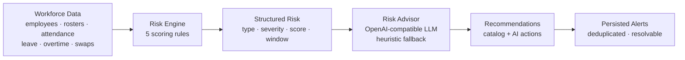

# WorkforceOS Architecture

**Status:** Draft | **Decision horizon:** MVP | **Implementation:** modular monolith with PostgreSQL (operational core + risk + outbox), Redis caching, and in-memory repositories retained only for the test profile

## 1. Architectural Direction

WorkforceOS is built as a modular monolith with Java 21, Spring Boot 3, PostgreSQL (via JPA and Flyway), Redis caching, and Spring Security with signed bearer tokens. Modules share one deployable runtime and database while keeping domain ownership, application services, and persistence boundaries explicit.

This balances delivery speed and transactional consistency with a path to later extract high-volume or independently scaled capabilities.

## 2. Logical Modules

- **Organization / Tenancy**: organizations as the tenant root, per-request tenant resolution (`TenantContext`), and the `organization_id` discriminator strategy.
- **Identity**: authentication, users, roles, token issuance.
- **Workforce**: employees, departments, teams, positions.
- **Scheduling**: shifts, rosters, assignments, conflict detection.
- **Attendance**: event ingestion and attendance calculation.
- **Requests**: leave, overtime, shift swap, and correction requests.
- **Approval**: reusable approval policies, actions, and history.
- **Handover**: handover reports, items, and acknowledgement.
- **Risk**: workforce risk intelligence, including the risk engine, advisors, alerts, and persisted assessments.
- **Notification**: notification intents and delivery adapters.
- **Audit**: immutable business and security audit records.
- **Reporting**: read-optimized operational queries.
- **Events**: transactional PostgreSQL outbox (in-memory store in the test profile) with delivery to in-process handlers and an optional Kafka relay (`KafkaRelayer`, enabled by `workforce.events.kafka.enabled`).

All modules are implemented as dedicated `com.workforceos.*` packages in the shared runtime.

## 3. Request Flow

```text
HTTP request -> authentication -> authorization -> controller
             -> application service -> domain rules -> persistence
             -> domain event / audit record -> response
```

Controllers remain thin. Application services coordinate module boundaries. Domain rules reject invalid transitions before persistence. Repositories do not expose persistence concerns to API clients.

## 4. Data and Integration Boundaries

PostgreSQL is the source of truth for the full operational domain — user accounts, departments, teams, employees, leave and overtime requests, schedules and roster assignments, attendance sessions and corrections, handovers, notifications, audit logs, shift swaps, approvals, and the risk module — via versioned Flyway migrations (`V1` through `V6`) validated against JPA entities. The `test` profile retains in-memory repositories for test isolation but all production persistence is transactional PostgreSQL. Redis provides read-through caching for reports and lookups (60-second TTL), not persistence.

Domain events are persisted in the same transaction as the triggering operation (transactional outbox pattern via `EventPublisher`), then delivered to in-process handlers with idempotent deduplication and bounded retry. `KafkaRelayer` forwards relayed entries to Kafka for external consumers (notifications, audit projection, analytics) when `workforce.events.kafka.enabled=true`, using an idempotent producer and a `kafka_published_at` marker for at-least-once delivery.

A `RateLimitFilter` token-bucket limiter keyed by client IP runs ahead of the security chain (`workforce.api-rate-limit.enabled`), returning HTTP 429 with `Retry-After` while exempting health and actuator endpoints.

The `assistant` module answers natural-language questions read-only: `AssistantIntentClassifier` maps the question to topics, `AssistantContextProvider` assembles a grounded snapshot from existing query services, and `HeuristicAssistant` answers offline while `LlmAssistant` uses the same OpenAI-compatible provider configuration as the risk advisor (`workforce.assistant.ai-*`, defaulting to `workforce.risk.ai-*`) with heuristic fallback.

The `analytics` module adds explainable (non-black-box) intelligence: `AbsenteeismAnalyticsService` scores per-employee absence/late risk from attendance and approved leave, and `DemandForecastService` projects per-weekday staffing demand from historical assignment volume. `AutoScheduleService` consumes those signals to produce an advisory plan that fills understaffed shift slots with eligible staff, leaving conflict validation and persistence to the existing `ScheduleEngine` assignment path.

External integrations are adapters behind module-owned ports. No external provider should be called directly from a controller or domain object.

## 5. Consistency Rules

- Roster assignment conflict checks and attendance eligibility are enforced by domain rules (`ScheduleEngine`, `AttendanceEngine`) before mutations are accepted; PostgreSQL transactions and unique constraints are introduced when these stores move to the database.
- Critical commands accept an idempotency key and persist the result for safe retries.
- Audit records are append-only from application code.
- Cross-module reads use explicit query services or reporting projections.
- Module code must not bypass another module's application boundary to mutate its tables.

## 6. Deployment Shape

The MVP is delivered as a Docker Compose stack: one stateless API service, PostgreSQL, Redis, and an nginx-backed Angular frontend that proxies `/api` to the backend. Health endpoints (custom `GET /api/v1/health` plus Spring Boot Actuator) support orchestration. Additional workers may be introduced for outbox/event delivery and notifications without changing the public API. Configuration and secrets are injected through environment variables with development defaults; see [DEPLOYMENT.md](DEPLOYMENT.md).

## 7. Architectural Risks

The main risks are shared-database coupling, event delivery failure, unclear tenant/organization boundaries, and attendance concurrency. These are addressed through module ownership, transactional outbox processing, the seeded organization model with a per-request `TenantContext` and per-table `organization_id` discriminator, unique constraints, locking where needed, and concurrency tests.

## 8. Open Decisions

- Full enforcement of tenant-scoped queries at the JPA repository layer (schema is tenant-ready; persistence-layer scoping is being hardened progressively across stores).
- Exact token issuer, key rotation, and JWT adoption.
- Kafka hosting and downstream consumer onboarding (the relay is implemented and broker delivery is configurable; consumer groups and schema registry are TBD).
- Report materialization strategy after baseline query measurements.

## 9. Risk Intelligence Pipeline

The risk module turns operational data into structured, persisted risks with explanations and mitigations. It is orchestrated by `RiskAnalysisService`, which is triggered on demand via the API and automatically by `RiskAnalysisScheduler` on roster publication, leave approval, overtime approval, and employee deactivation events, plus a periodic cron recompute.



The five rules, all with deterministic scoring and sliding-window aggregation:

- `CoverageShortfallRule` — leave or inactive employee leaves a published shift uncovered; current-day impact via swap coverage; rates `HIGH`.
- `StaffingLiquidityRule` — scheduled demand exceeds active staff over a weekly Monday-bucketed horizon.
- `AttendanceTrendRule` — recent late / early-departure incidents exceed the issue threshold within the configured attendance window.
- `OvertimeDependencyRule` — approved overtime concentrated on the same employees within the rolling overtime window.
- `SinglePointOfFailureRule` — single-point-of-failure overnight shifts with no backup assignee.

`RiskImpactCalculator` derives a composite risk index as a severity-weighted average of assessment scores (weights `HIGH` 1.0, `MEDIUM` 0.6, `LOW` 0.3), computes slot coverage from uncovered assignments, and converts uncovered hours to a labor-cost estimate; severity is banded `HIGH ≥ 80`, `MEDIUM 50–79`, `LOW < 50`, and compliance flags surface overnight single-coverage, absenteeism watch, and sub-90% coverage.

Persistence: assessments, recommendations, and alerts are transactional JPA entity classes mapped to the Flyway `V2__risk.sql` tables, with an assessment dedupe key of `type:entityId:windowStartMillis` and sliding window buckets (`weekBucket`, `monthBucket`) so repeated runs stay idempotent. Adapters are ports: `RiskAdvisorPort` is used by the service so the heuristic advisor and the OpenAI-compatible `LlmRiskAdvisor` are interchangeable and the external call never happens from a controller.

## 10. Frontend Integration

The Angular frontend implements three guarded pages behind a shared header: the home workforce overview (dashboard KPIs, headcount by department, recent employees), an employee management page (list, create, edit, deactivate, search), and the risk intelligence page. The risk page mirrors the pipeline visually: `RiskPipelineComponent` renders the six pipeline stages, and `RiskDashboardComponent` presents the persisted summary (KPI cards, latest analysis, advisor mode), interactive charts (severity mix, risk by type, risk by department, detections per day), a resolvable alerts table, and an expandable assessments table with recommendations and a run-analysis action. All pages use the same `authGuard`, `AuthService` token handling, and `AuthInterceptor` bearer attachment.
